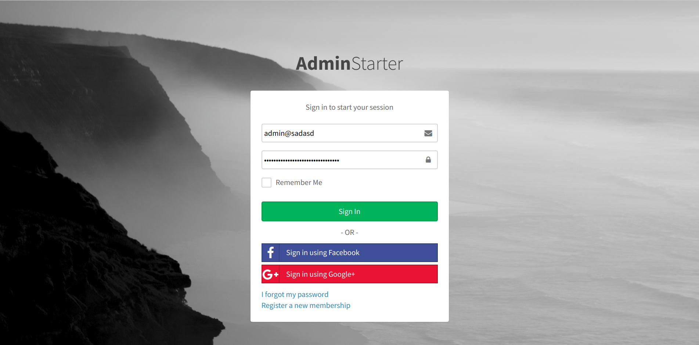
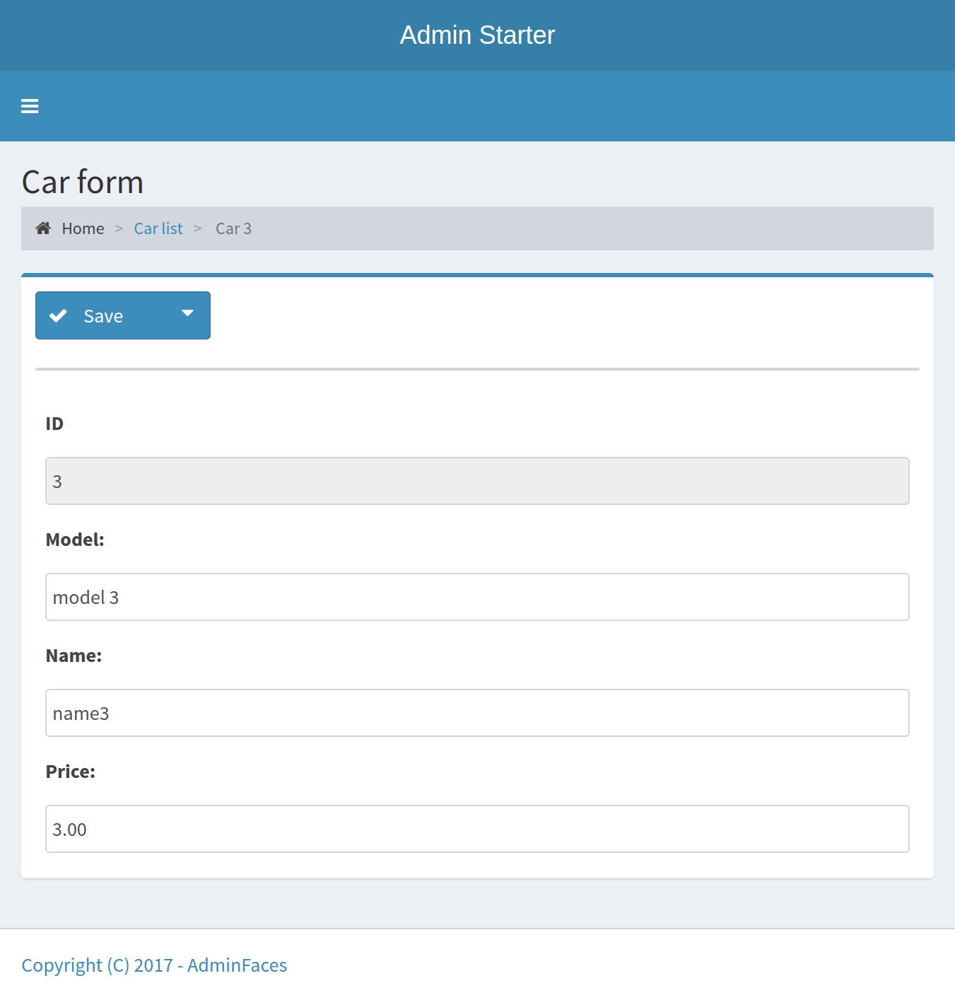

= AdminFaces Starter project (Wildfly)

Projeto derivado do repositório https://github.com/adminfaces/admin-starter-tomcat[admin-starter-tomcat^]. Adaptado para servidor JavaEE.

== Template 

 Uso do template free https://adminlte.io/themes/AdminLTE/index2.html[AdminLTE^].

== Execução

----
mvn clean package
----

Deploy `admin-starter.war`.

Testado no http://wildfly.org/downloads[wildfly-10.1.0.Final^]

== Demo

Página de demonstração no Openshift: http://admin-starter-admin-starter.1d35.starter-us-east-1.openshiftapps.com/admin-starter/

== Screenshots

.Login page

.Car list
image:starter2.png[]

.Car form
image:starter3.png[]

.Car form responsive

